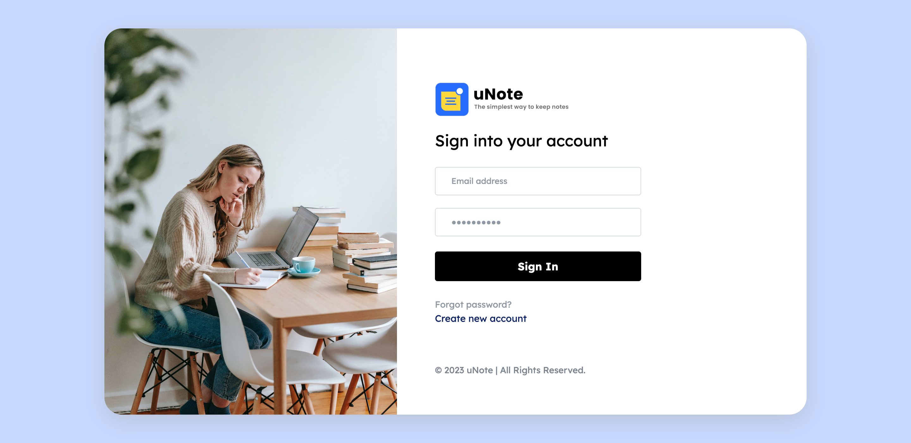
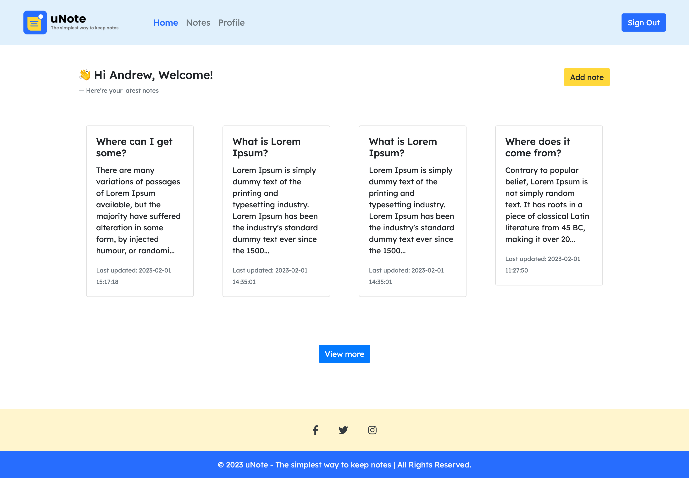
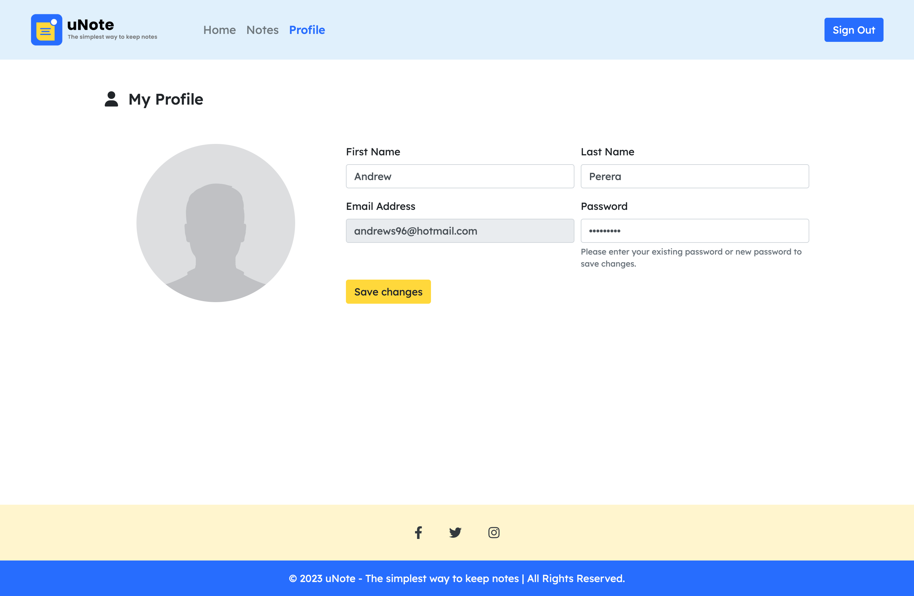

  
  <h1 align="center">uNote - The simplest way to keep notes</h1>
  
<i>uNote is a top online notepad app to take notes straight on your device.</i>

 
There's nothing better than doodling down fleeting thoughts as they arise, and a note-taking app is a perfect place to put them. So, having a good note-taking app is like having our own personal internet where we can search for everything that we need to know about our personal or work life, wherever we are.
  
We can write notes anywhere; on envelopes, on important bills, in a notebook or a diary and etc. Not only that, we can also write notes in apps like Google Docs & Microsoft Word. But that is totally weird, because they are not really designed for them.
  
So, this is a web-based note taking application which is explicitly designed to be a note app. It will be an open-source note-taking app mainly focused on continuity, user privacy & ease of use.

 &nbsp; 
  
 &nbsp; 

 

## Technologies
  - `Front-End`: Angular, HTML, CSS, JS & TS, Bootstrap, Font Awesome
  - `Back-End`: NodeJs, JS, Express, MongoDB, Mongoose, Nodemon, Dotenv, CORS, JSON, JWT, Morgan, bcryptjs, body-parser, etc..
  
`Express` used as the middleware to create CRUD endpoints 
`Mongoose` used for managing data in MongoDB using queries 
`Nodemon` used to restart the server whenever saving the files 
`bcryptjs` used to hash the passwords into the protected strings 
`Dotenv` used to manage the `.env` file. 
`CORS` is a express js middleware. Used to enable CORS. etc... 

 

## Installation and Setup Instructions
1. Clone this repository. You will need `node` and `npm` installed globally on your machine.
2. Open the full-project using VSCode or any other preferred code editor.
3. Navigate to the `client/uNote` directory and run `npm install` to install dependencies.
4. Navigate to the `server` directory and run `npm install` to install dependencies.
5. Run the command `nodemon server` within the `server` directory via terminal.
6. Run the command `ng serve` within the `client/uNote` directory via terminal.
7. Visit App: `http://localhost:4200`
